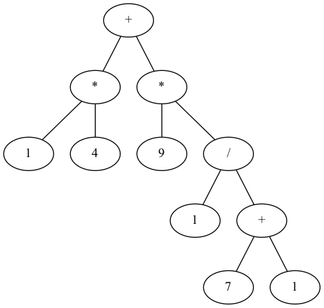

# Recursive-descent parser in Python

This project is about building a lexer and a parser to analyse basic mathematical arithmetic operations. The aim is to eventually combine the parser with an interpreter to implement a small calculator.

The aim of the project is purely educational and is about practically understanding the low-level implementation of programming languages. Roughly speaking, it is about understanding how the machine processes computer code from a set of human-friendly instructions based on a pre-defined grammar to computer-interpretable commands.

The project leveraged the object oriented feature of Python - in particular, classes were used to define the components of our mathematical grammar (ie. the so-called "tokens") as well as their attributes. The use of classes implified the way objects were called in the both the lexer and parser algorithms.
## Features of the grammar & parser description

Valid expressions parsed by our program include:

```
2 + 3 * 5
1 + 1 + (2 - 1)
8 / 4 / 2
-1 - -1
```

The grammar must satisfy a number of properties in order to be parsed:

* It must be *predictive* ie. we can safely predict which symbol follows another in our expression. This ensures the parser knows what rule to use when parsing the epxression.

* It must be *context-free* ie. the grammar does not change under any circumstances exterior to its rules.

* It must be *unambiguous* ie. a given expression can only be interpreted in one way and, as such, the parser generates a correspondingly unique parse tree. The requirement to have unambiguity is essential for our parser to work as it is a deterministic finite state machine.


* It must not be *left recursive* ie. no string in the grammar can decompose into itself followed by a suffix.

The above features define a grammar that can be parsed using a special class of parsers under the LL(k) type (for Left-to-right, Leftmost look-ahead by k tokens). We implement the simplest of those, namely the LL(1) parser. The parser "peaks" into a single token prior to consuming it by which it identifies the appropriate grammatical rule. The rule identified by our parser when analysing the syntax of the input is unambiguously correct, in the sense that no back-tracking is required when a production rule has several alternatives. The back-tracking is of no harm; in fact it is even a stronger implementation as it explores all the possible productions that the grammar can accept. We do not implement it here because of its inefficiency and content ourselves instead with a predictive recursive-descent parser.

Our LL(1) grammar is defined by the following production rules (in a way that avoids left recursion):

```
expr    ⟶ term
term    ⟶ term ("+" | "-") factor | factor
factor  ⟶ factor ("*" | "/") unary | unary
unary   ⟶ "-" unary | primary
primary ⟶ "(" expr ")" | NUMBER | $
```

> Note: ```expr```, ```term```,```factor```, ```unary``` and ```primary``` are all non-terminals. They define the grammar according to the production rule where ```⟶``` can be interpreted as "represented by". All other variables, such as ```NUMBER``` or operations ```+, -, *, /``` are terminals ie. they are the symbols of our grammar. Finally the ```$``` sign represents the final terminal denoting the end of the expression.

We can then simplify the grammar in regex-like notation to get:

```
expr    ⟶ term
term    ⟶ factor ( ("+" | "-") factor )*
factor  ⟶ unary ( ("*" | "/") unary )*
unary   ⟶ "-" unary | primary
primary ⟶ "(" expr ")" | NUMBER | $
```
This notation yields the following code implementation:

| Grammar notation | Code implementation                                                  |
| ---------------- | -------------------------------------------------------------------- |
| Terminal         | Match and eat a token                                                |
| Nonterminal      | Call to the corresponding rule function                              |
| `\|`             | `if` or `switch` (or peek current token to choose an expansion rule) |
| `*` or `+`       | `while` or `for` loop to match the regex group                       |
| `?`              | `if` condition (match and eat a token only if present)               |


## Implementation of the lexer-parser:

The first step of the program consists in the lexical analysis ie. making sure the symbols in our input are recognised by the computer according to the grammar. This is accomplished by the ```Tokenize()``` function. The lexer breaks down the input into tokens which it then pushes into the ```tokens``` list of the ```TokenStack()``` class. The tokenize function verifies that each character of the input is corect, and it not, it raises an error message:

```python
class ScanningError(Exception):
    def __init__(self, character):
        super().__init__(f"Scanning error: unrecognized token '{character}'")
```

The recursive-descent parser follows next and is implement by creating functions for each non-terminal and calling them recursively according to the grammar rules. Let's go a step back and understand why left recursion should be avoided in our program. Consider the function for the non-terminal ```term```. If the grammar were left-recursive, we would get an infinite recursion problem where ```term()``` is called inside itself.

```python
def term():
    left = term() # Oops
    while match("+", "-"):
        operator = eat()
        right = factor()
        expr = Infix(left, operator, right)
    return expr
```

### The AST:

The current output of our parser is the abstract syntax tree (AST) of the input. The AST has several features: it is a binary tree, the operations are always parent nodes and the syntatic details like the parenthesis are ommitted. The AST is in fact a compact version of the parse tree (also known as comptact syntax tree (CST)) but unlike the CST it ommits all the syntatic clutter and focuses on the input represented in a hierarchical data structure. In that sense, it is naturally more useful for the semantic analysis of the language of the language grammar.

The tree is constructed in a top-down fashion. After the lexer has completed the lexical analysis, the parser analyses the expression from left to right and constructs the tree starting from the root node at the top where input will be read from left to right. The corresponding structure also respects the precedence order established by the grammar (essentially BIDMAS in our case). The grammar uses top-down operator precedence, where the precedence order is low to high. This is confusing: rules at the top of the grammar have a lower precedence value while rules at the bottom have an higher one.

The AST is constructed by traversing the implicit CST generated by the parser. Since the tree is constructed top down, a depth-first search (DFS) travel is performed on the CST (practically, the nodes are created in the ```Syntax()``` class functions according to the ```TreeNode()``` class attributes and then the edges are created in the DFS in-order traversal under the appropriate function)

To have a better visualisation of the AST, the ```pydot``` and ```Graphviz``` Python libraries were used. The libraries are based on the ```DOT``` graph description language. The ```pydot``` library functions facilitate the graph rendering and allows it to handle more complicated expressions.

For a simple graph like this:



corresponding to the expression ```2 * 9 + 3 * 8```

the DOT code can be written manually:

```
+ -> * -> 2
+ -> * -> 9
+ -> * -> 8
+ -> * -> 3
```
As the ```*``` are two distinct operations (in the sense that they are part of different expressions), identifiers were used when invoking the tree nodes to distinguish them - so as to have ```+``` point to both ```*``` in the AST


### Further steps:

Next steps for the improvement and completion of the project are building an interpretor and handling potential errors in the expression (such as having two consecutive ```+``` signs).

### Useful resources:

1. http://craftinginterpreters.com/parsing-expressions.html
2. https://en.wikipedia.org/wiki/DOT_(graph_description_language)
3. https://eli.thegreenplace.net/2009/02/16/abstract-vs-concrete-syntax-trees
4. https://github.com/muthukumarse/books/blob/master/Dragon%20Book%20Compilers%20Principle%20Techniques%20and%20Tools%202nd%20Edtion.pdf

